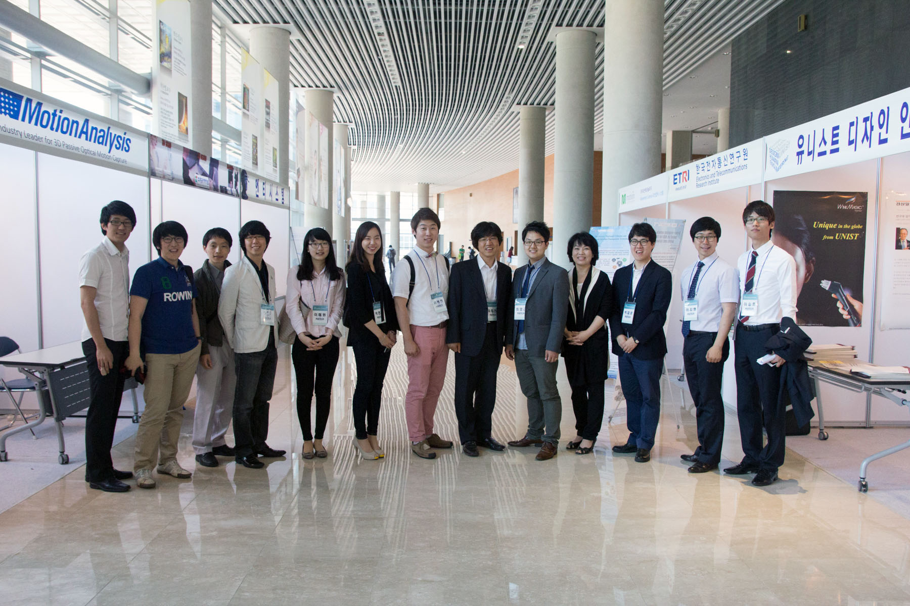
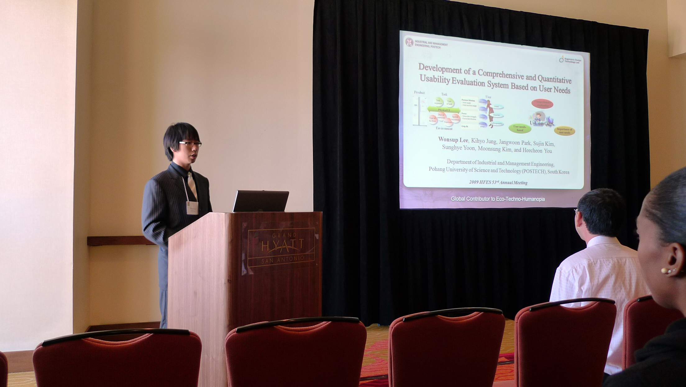
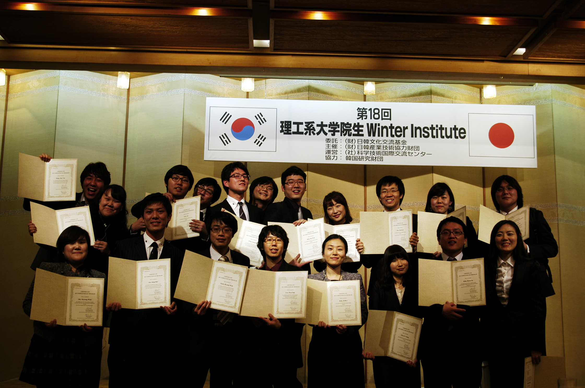
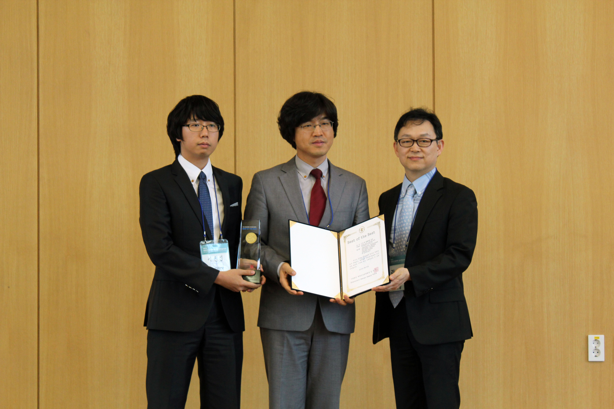
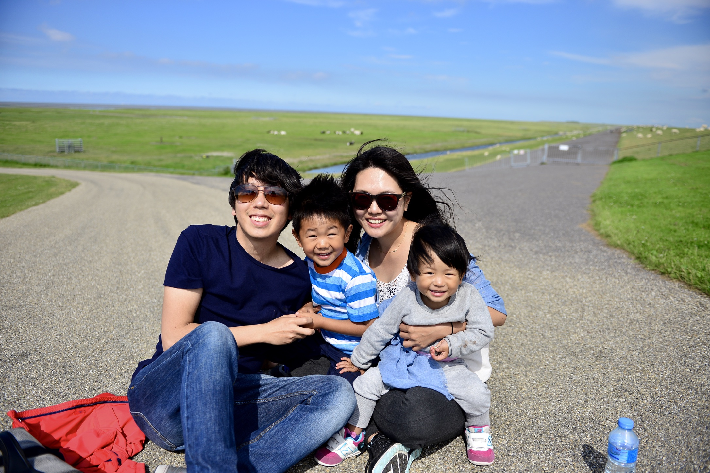
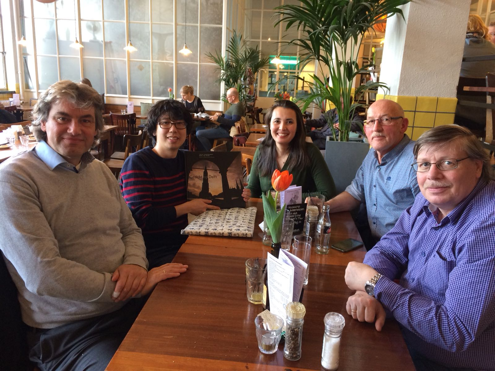
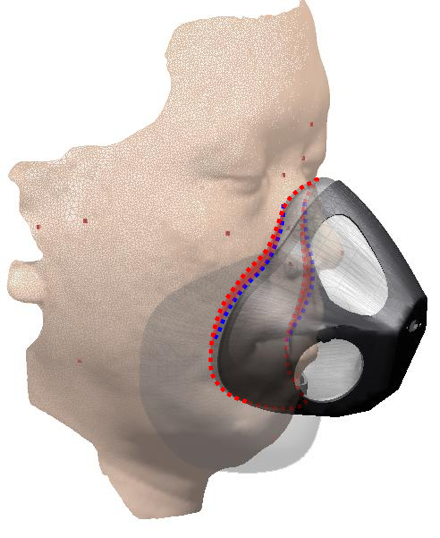

[Home](README.md) | [Research](research.md) | [Publication](publication.md)

 
### Short Bio
I am currently working as an assistant professor in School of Global Entrepreneurship and Information Communication Technology (GE&ICT) at Handong Global University (HGU) in Pohang, South Korea. I started my academic career in Industiral Design in 2002 at HGU, then studied in Industrial Engineering (especially in Human Factors and Ergonomics) at Pohang University of Science and Technology (POSTECH). After I recieved my doctorate in 2013, I worked as a post-doctoral research staff for total of 4.5 years at POSTECH (1.5Y) and Industrial Design Engineering at Delft University of Technology in the Netherlands (3Y).

With my interdisciplinary perspectives in design, engineering, and technologies, I’ve broadly studied on industrial design and ergonomics topics including new product development, user-centered design, UI/UX design, HCI, service development, sustainable design, biomechanics, digital ergonomics, medical/healthcare engineering, and system development. Over the years, through my active participation in more than 45 research projects, I've gained academic achievements including 30+ peer-reviewed journal papers, 80+ converence proceedings, 6 patents, 2 goverment research grants as a PI, 3 academic awards, and so on.

As shown in the publication list below, my major research area that I've actively worked for the last decade is digital human modeling and engineering design methods using 3D/4D scans. My current research and teaching in HGU cover a broad range of Human Factors and Ergonomics, Human-Computer Interaction, and Human-Centered Product/Service Development.

### Education & Professional Career
- Assistant Professor, School of Global Entrepreneurship and Information Communication Technology, Handong Global University, South Korea, Mar 2018 - present
- Owner, Humanopia, the Netherlands, Jan 2017 - Feb 2018
- Post-doctoral researcher, Industrial Design Engineering, Delft University of Technology, the Netherlands, Jan 2015 - Feb 2018
- Post-doctoral researcher, Industrial Engineering, Pohang University of Science and Technology, South Korea, Sept 2013 - Dec 2014
- Ph.D., Industrial Engineering, Pohang University of Science and Technology, South Korea, Aug 2013
- B.S., Industrial Design, Handong Global University, South Korea, Feb 2006

### Research Interests
- Ergonomic Engineering/Design
  - Human-centered product/service/system design and development
  - Medical and healthcare device/system development
  - User-friendly sports/safety/military equipment design
  - Universal design for children, seniors, and people with disabilities
  - Appropriate technology and humanitarian design
  - Human performance & workload assessment
  - Usability & UX evaluation
  - Innovative design methods and technologies
- Digital Ergonomics
  - Digital human modeling
  - 3D/4D scanning and processing
  - Anthropometric sizing and shape analysis
  - Virtual fit/pressure simulation and design optimization
  - Medical image analysis and surgery simulation
- Engineering Education Methods

### Courses Taought
- Human Factors and Ergonomics
- Emotional and Cognitive Engineering
- Product Planning and Development
- Human-Computer Interaction
- Data Visualization
- Introduction to ICT Engineering

### Professional Affiliations

### Services

### Other links
- Personal Pages
  - LinkedIn: [https://www.linkedin.com/in/wonsuplee/](https://www.linkedin.com/in/wonsuplee/)
- Educational Pages
  - Github: [https://github.com/HandongHCI](https://github.com/HandongHCI)
  - Facebook Page: [http://facebook.com/HandongHCI](http://facebook.com/HandongHCI)
- Publication Records
  - ORCID: [https://orcid.org/0000-0002-8094-1251](https://orcid.org/0000-0002-8094-1251)
  - Google Scholar: [https://scholar.google.co.kr/citations?user=KAVL3vQAAAAJ&hl=en](https://scholar.google.co.kr/citations?user=KAVL3vQAAAAJ&hl=en)
  - Scopus: [https://www.scopus.com/authid/detail.uri?authorId=55582098000](https://www.scopus.com/authid/detail.uri?authorId=55582098000)
  - ResearchGate: [https://www.researchgate.net/profile/Wonsup_Lee](https://www.researchgate.net/profile/Wonsup_Lee)

 

