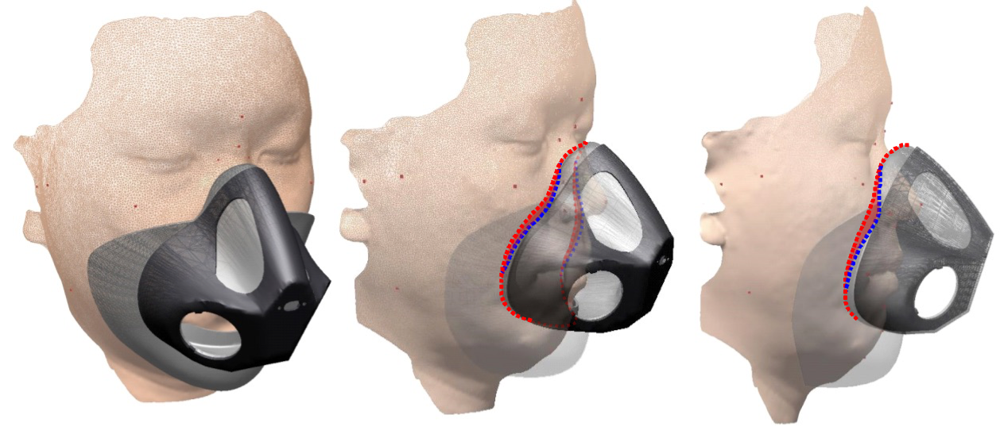

[Home](README.md) | [Research](research.md) | [Publication](publication.md)

## Short Bio
I am currently the CEO of Comfo Labs, Inc. Previously, I served as an associate professor in the School of Global Entrepreneurship and Information Communication Technology (GE&ICT) at Handong Global University (HGU) in Pohang, South Korea, focusing on ergonomics, human-computer interaction (HCI), ICT convergence, and innovative product/service development. My academic journey began with a Bachelor’s degree in Industrial Design at HGU in 2002, followed by further studies in Industrial Engineering with a specialization in Human Factors and Ergonomics at Pohang University of Science and Technology (POSTECH). After earning my doctorate in August 2013, I gained 4.5 years of post-doctoral research experience, working at POSTECH (1.5 years) and in the Department of Industrial Design Engineering at Delft University of Technology in the Netherlands (3 years).

My interdisciplinary expertise spans design, engineering, technology, and business. I have taught a wide range of subjects, including new product/service development, business startups, user-centered design, UI/UX design, HCI, biomechanics, digital ergonomics, medical/healthcare engineering, and software development.

Over the past decade, my primary research focus has been digital human modeling using 3D/4D body scans and engineering design methods for developing human-friendly products. Building on 15 years of research and expertise, I founded Comfo Labs, Inc. in April 2024.

## Education & Professional Career
- CEO, N 8 10, LLC., South Korea, Apr 2024 - present
- Associate Professor, School of Global Entrepreneurship and Information Communication Technology, Handong Global University, South Korea, Mar 2024 - August 2024
- Assistant Professor, School of Global Entrepreneurship and Information Communication Technology, Handong Global University, South Korea, Mar 2018 - Feb 2024
- Owner/Freelancer, Humanopia, the Netherlands, Jan 2017 - Feb 2018
- Post-doctoral researcher, Industrial Design Engineering, Delft University of Technology, the Netherlands, Jan 2015 - Feb 2018
- Post-doctoral researcher, Industrial Engineering, Pohang University of Science and Technology, South Korea, Sept 2013 - Dec 2014
- Ph.D., Industrial Engineering, Pohang University of Science and Technology, South Korea, Aug 2013
- B.S., Industrial Design, Handong Global University, South Korea, Feb 2006

## Research Interests
- Ergonomic Engineering/Design
  - Human-centered product/service/system design and development
  - Medical and healthcare design
  - Engineering design methods and technologies
  - Usability & UI/UX Design and evaluation
  - Universal design for children, seniors, and people with disabilities
  - Appropriate technology and humanitarian design
- Digital Ergonomics
  - Digital human modeling
  - 3D/4D scanning and processing
  - Anthropometric sizing and shape analysis
  - Virtual fit simulation and design optimization
- Engineering Education Methods
- Lean Startup and Agile Development

## Courses Taught
- Undergraduate
  - Human Factors and Ergonomics
  - Emotional and Cognitive Engineering
  - Product Planning and Development
  - Human-Computer Interaction
  - Data Visualization
  - Ideation and Prototyping
  - Introduction to ICT Engineering
- Graduate
  - Healthcare System Design
  - Human Data Measurement and Analysis

## Services
- Board Member, YMCA Pohang, Mar. 2021 - 2023
- Board Member, Ergonomics Society of Korea, Jan. 2020 - Present
- Reviewer, [Human Factors and Ergonomics in Manufacturing & Service Industries](https://www.onlinelibrary.wiley.com/journal/15206564)
- Reviewer, [Applied Ergonomics](https://www.journals.elsevier.com/applied-ergonomics)
- Reviewer, [Journal of the Ergonomics Society of Korea](http://www.jesk.or.kr/)
- Reviewer, [Journal of the Korean Society of Safety](http://www.kosos.or.kr/jkosos/)

## Other links
- Personal Pages
  - LinkedIn: [https://www.linkedin.com/in/wonsuplee/](https://www.linkedin.com/in/wonsuplee/)
- Educational Pages
  - GitHub: [https://github.com/HandongHCI](https://github.com/HandongHCI)
  - GitHub Page: [https://HandongHCI.github.io](https://github.com/HandongHCI)
  - Facebook Page: [http://facebook.com/HandongHCI](http://facebook.com/HandongHCI)
- Publication Records
  - ORCID: [https://orcid.org/0000-0002-8094-1251](https://orcid.org/0000-0002-8094-1251)
  - Google Scholar: [https://scholar.google.co.kr/citations?user=KAVL3vQAAAAJ&hl=en](https://scholar.google.co.kr/citations?user=KAVL3vQAAAAJ&hl=en)
  - Scopus: [https://www.scopus.com/authid/detail.uri?authorId=55582098000](https://www.scopus.com/authid/detail.uri?authorId=55582098000)
  - ResearchGate: [https://www.researchgate.net/profile/Wonsup_Lee](https://www.researchgate.net/profile/Wonsup_Lee)

 

