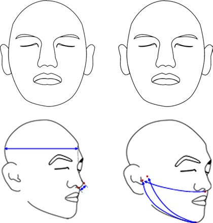

[Home](README.md) | [Research](research.md) | [Publication](publication.md) | [Facility](facility.md) | [Teaching](https://handonghci.github.io/Courses/){:target="_blank" rel="noopener"}

## Featured Publications (selected)

1.	**Lee, W.**, Molenbroek, J.F.M., Goto, L., Jellema, A.H., Song, Y., and Goossens, R.H.M. (2019). Application of 3D scanning in design education. In S. Scataglini and G. Paul (Eds.), *DHM and Posturography* (pp. 721-732). Cambridge, MA: Academic Press (imprint of Elsevier). (ISBN: 978-0-12-816713-7). (DOI: [10.1016/B978-0-12-816713-7.00056-8](https://doi.org/10.1016/B978-0-12-816713-7.00056-8)) 

1. Goto, L., **Lee, W.**, Molenbroek, J.F.M., Cabo, A., and Goossens, R.H.M. (2019). Traditional and 3D scan extracted measurements of the head and faces of Dutch children. *International Journal of Industrial Ergonomics, 73*, art. no. 102828. (DOI: [10.1016/j.ergon.2019.102828](https://doi.org/10.1016/j.ergon.2019.102828))

1. Lee B, **Lee W**, Yang X, Jung K, and You H (2019). Development of a distributed representative human model generation and analysis system (DRHM-GAS): Application to optimization of a flight suit sizing system. *International Journal of Industrial Ergonomics, 72*, 261-272. (DOI: [10.1016/j.ergon.2019.06.005](https://doi.org/10.1016/j.ergon.2019.06.005)) 

1. Yang X, Tjolleng A, **Lee W**, Park S, Lee B, Jeong J, Kim J, Hong W, You H, and Park S (2019). Analysis of natural finger-press motion for ergonomic button design of a trackball. *Ergonomics, 62*(6), 767-777. (DOI: [10.1080/00140139.2019.1587006](https://doi.org/10.1080/00140139.2019.1587006))

1. **Lee W**, Yang X, Jung H, Bok I, Kim C, Kwon O, and You H (2018). Anthropometric analysis of 3D ear scans of Koreans and Caucasians for ear product design. *Ergonomics, 61*(11), 1480-1495. (DOI: [10.1080/00140139.2018.1493150](https://doi.org/10.1080/00140139.2018.1493150)) 

1. Jung K, Kim J, **Lee W**, You T, Lee B, Jung J, Kim K, Hong W, Choi W, Park S, Chang S, and You H (2018). Development of an ergonomic console layout optimization method using priority-based branch-and-bound algorithm and clustering analysis. *Journal of the Ergonomics Society of Korea, 44*(3), 189-197.

1. **Lee W**, Lee B, Yang X, Jung H, Bok I, Kim C, Kwon O, and You H (2018). A 3D anthropometric sizing analysis system based on North American CAESAR 3D scan data for design of head wearable products. *Computer and Industrial Engineering, 117*, 121-130. (DOI: [10.1016/j.cie.2018.01.023](https://doi.org/10.1016/j.cie.2018.01.023)) 

1. **Lee W**, Yang X, Jung D, Park S, Kim H, and You H (2018). Ergonomic evaluation of pilot oxygen mask designs. *Applied Ergonomics, 67*, 133-141. (DOI: [10.1016/j.apergo.2017.10.003](https://doi.org/10.1016/j.apergo.2017.10.003)) 

1. **Lee W**, Yang X, Yoon S, Lee B, Jeon E, Kim H, and You H (2017). Comparison of a semiautomatic protocol using plastering and three-dimensional scanning techniques with the direct measurement protocol for hand anthropometry. *Human Factors and Ergonomics in Manufacturing & Service Industries, 27*(3), 138-146. (DOI: [10.1002/hfm.20697](https://doi.org/10.1002/hfm.20697)) 

1. Chang J, Jung K, **Lee W**, and You H (2017). Development of a usability evaluation method using natural product-use motion. *Applied Ergonomics, 60*, 171-182. (DOI: [10.1016/j.apergo.2016.11.015](https://doi.org/10.1016/j.apergo.2016.11.015)) 

1. Meijer B, Wolff J, van Eijnatten M, **Lee W**, and Forouzanfar T (2017). Three-dimensional assessment of morphological changes of the face following bilateral sagittal split osteotomy. *International Journal of Oral and Maxillofacial Surgery, 46*(Suppl. 1), 164.

1. Tjolleng A, Jung K, Hong W, **Lee W**, Lee B, You H, Son J, and Park S (2017). Classification of a driver’s cognitive workload levels using artificial neural network on ECG signals. *Applied Ergonomics, 59*, 326-332. (DOI: [10.1016/j.apergo.2016.09.013](https://doi.org/10.1016/j.apergo.2016.09.013))

1. **Lee W**, Yang X, Jung H, You H, Goto L, Molenbroek JFM, and Goossens RHM (2016). Application of massive 3D head and facial scan datasets in ergonomic head-product design. *International Journal of the Digital Human, 1*(4), 344-360. (DOI: [10.1504/IJDH.2016.084592](https://www.inderscienceonline.com/doi/abs/10.1504/IJDH.2016.084592)) 

1. Yang X, Yu H, Choi Y, **Lee W**, Wang B, Yang J, Hwang H, Kim J, Song J, Cho B, and You H (2014). A hybrid semi-automatic method for liver segmentation based on level-set methods using multiple seed points. *Computer Methods and Programs in Biomedicine, 113*, 69-79. (DOI: [10.1016/j.cmpb.2013.08.019](https://doi.org/10.1016/j.cmpb.2013.08.019)) 

1. Hong W, **Lee W**, Jung K, Lee B, Park J, Park S, Park Y, Son J, Park S, and You H (2014). Development of an ECG-based assessment method for a driver’s cognitive workload. *Journal of the Korean Institute of Industrial Engineers, 40*(3), 325-332.

1. **Lee W**, Jeong J, Park J, Jeon E, Kim H, Jung D, Park S, and You H (2013). Analysis of the facial anthropometric data of Korean pilots for oxygen mask design. *Ergonomics, 56*(9), 1451-1464. (DOI: [10.1080/00140139.2013.816376](https://doi.org/10.1080/00140139.2013.816376)) 

1. **Lee W**, Jung K, Jeong J, Park J, Cho J, Kim H, Park S, and You H (2013). An anthropometric analysis of Korean male helicopter pilots for helicopter cockpit design. *Ergonomics, 56*(6), 879-887. (DOI: [10.1080/00140139.2013.776703](https://doi.org/10.1080/00140139.2013.776703)) 

1. Jung K, Kim J, You T, Lee B, **Lee W**, Park S, Roh W, and You H (2012). A characteristic analysis of ergonomic console layout studies using optimization techniques. *Journal of the Ergonomics Society of Korea, 31*(6), 733-740.

1. **Lee W**, Jung K, Lee, H, Song H, Oh J, and You H (2011). Development of a comprehensive usability testing and analysis framework for the physical interface between product and user. *Journal of the Ergonomics Society of Korea, 30*(2), 331-338.

1. Jung K, Park J, **Lee W**, Kang B, Uem J, Park S, and You H (2010). Development of a quantitative ergonomic assessment method for helicopter cockpit design in a digital environment. *Journal of the Ergonomics Society of Korea, 29*(2), 203-210.

1. **Lee W**, Park J, Kim S, Yoon S, Yang X, Lee Y, Son J, Kim M, and You H (2010). Development of an analysis system for biosignal and driving performance measurements. *Journal of the Ergonomics Society of Korea, 29*(1), 47-53.