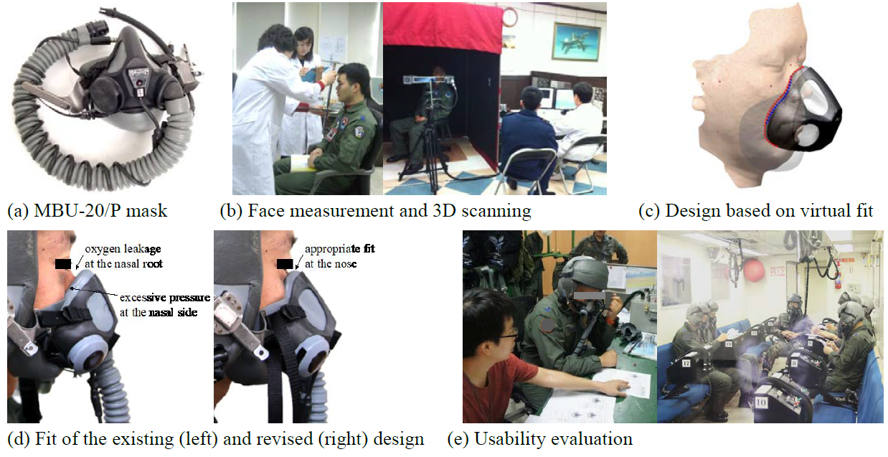
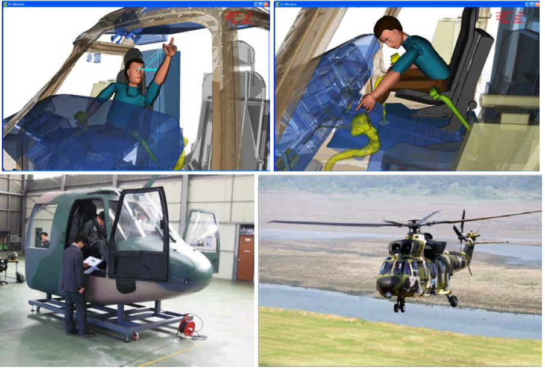
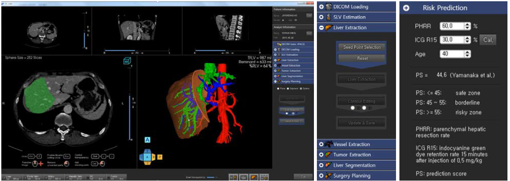
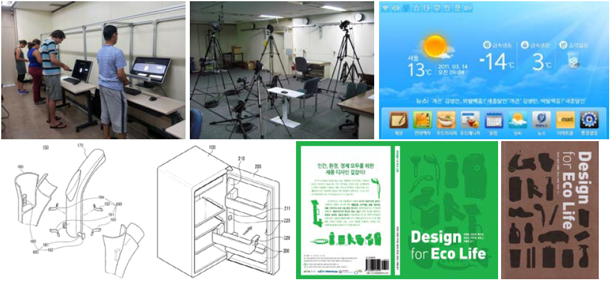
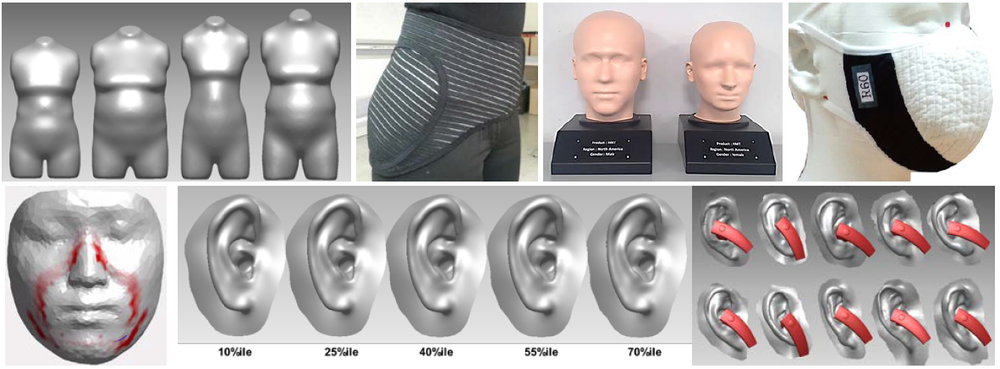
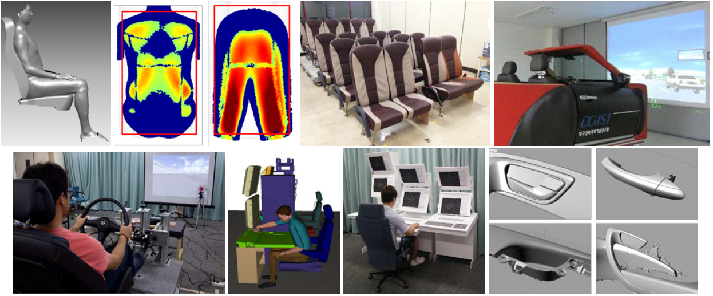
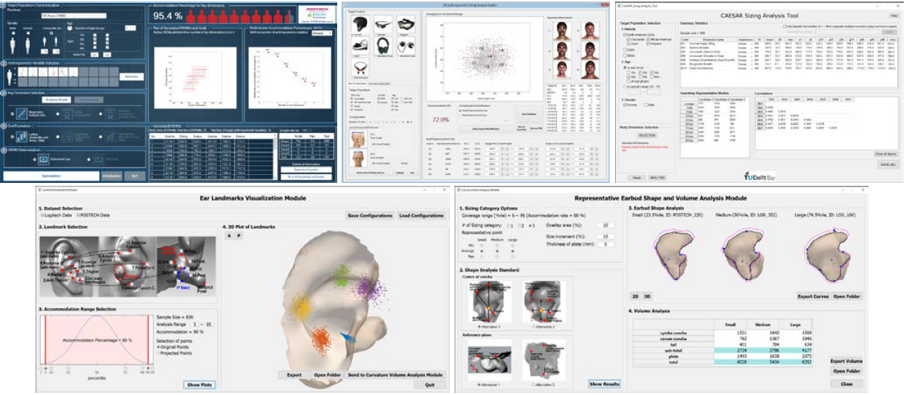

[Home](README.md) | [Research](research.md) | [Publication](publication.md)

 
## Research Cases

### Ergonomic oxygen mask for Korean Air Force pilots (will be commercialized soon)
- Research period: Nov. 2010 ~ Oct. 2012
- Funding source: Republic of Korea Air Force Logistics Command
- Summary: The existing pilot oxygen mask (model: MBU-20/P, Gentex Corporation, Simpson, PA, USA) designed based on the facial size and shape of U.S. Air Force pilots does not fit well to the face of Korean pilots due to different anthropometric characteristics between two groups. This study proposed a revised oxygen mask design for Korean Air Force pilots using 3D facial scan images of 350 Korean pilots through a virtual fit analysis and design optimization methods proposed by this study. Then, prototypes of the designed oxygen mask design were tested with Korean pilots; and they showed better fit to Korean pilots’ faces compared to the existing mask. As my PhD study, I entirely coordinated whole process of this project.

### Cockpit design of Korean Army utility helicopter, Surion (commercialized in 2013)
- Research period: Nov. 2006 – Oct. 2008
- Funding source: Korea Aerospace Industries (KAI), Ltd.
- Summary: The interior size and occupational layout of the helicopter cockpit was designed in this project through anthropometric analysis of Korean Army personnel, virtual ergonomic simulation, and usability evaluation of a real-size prototype. I participated in anthropometric analysis, CAD handling, and virtual simulation works in this project. Ergonomic criteria such as posture comfort, reachability, visibility, and seating adjustability of the cockpit design were virtually assessed using Jack, a virtual human model simulation software, with three representative models (size: 5%ile, 50%ile, 95%ile) of Korean Army personnel. This project was a part of the 7-year national project for development of the first Korean-made helicopter, granted by Korean government. The developed helicopter was commercialized in 2013.

### Dr. Liver, Virtual liver surgery planning system (commercialized in 2012)
- Project period: Dec. 2008 ~ Mar. 2015
- Funding source: Chonbuk National University Hospital
- Summary: Dr. Liver is a surgery planning system specialized for the liver. Dr. Liver helps surgeons to quickly get 3D reconstructed images of the liver and internal vessel structures as well as tumors from CT scan images of a patient. Also, Dr. Liver provides accurate volume information of total liver, tumors, and partial liver area which will be incised. A user-friendly designed interface supports surgeons to get those results with an easy manner. System’s features, functions, interfaces, and interaction methods were developed based on demands of surgeons. I had occasionally co-worked with other researchers on medical image analysis algorithm (language: C++, Matlab), user interface programming (language: Qt), commercialization, and application for medical certifications during several years. This study was a part of a national medical research project granted by Korean government. Dr. Liver was commercialized in 2012. 
- Product information: [http://edt.postech.ac.kr/www_humanopia/products_dr_liver.php](http://edt.postech.ac.kr/www_humanopia/products_dr_liver.php)

### Ergonomic/eco-friendly home appliance designs
- Funding sources: Samsung Electronics, LG Electronics, Ministry of Environment
- Summary: I have participated in multiple projects related to design and/or evaluation on formfactor, interior, information on interface panel, and mechanical property of home appliances such as refrigerator, vacuum cleaner, washer, et cetera. User needs and user experiences as well as biomechanical information such as motion, posture, muscle force, and pressure were surveyed, then the collected data were analytically applied to resolve current usability problems. Among hundreds of new ideas/concepts we have made based on the collected data, a lot of engineering ideas have been applied by industry practitioners within their existing or upcoming commercial products. Two technical ideas were published as patents. Besides of the industry projects, I participated in a three-year project of eco-friendly design research granted by Korean government. Based on benchmarking surveys, seminars, newly introduced coursework, and student projects on eco-design, we published two books entitled ‘Design for Eco Life’ which contain hundreds of examples of eco-friendly products with describing their eco-friendliness and sustainability features.

### Wearable/Protective products based on 3D scans
- Funding sources: Samsung Electronics, Bose Corporation, GP Acoustics, Decathlon S.A. Logitech International S.A., National Research Foundation of Korea
- Summary: Since I’ve started my professional career in 3D scanning and digital human modeling areas, I have coordinated or participated in more than 10 research projects on wearable product design until now. The target wearable projects of my research include oxygen mask, dust-proof mask, medical respirator, hip protective pants, earphone, VR headsets, et cetera. Hundreds or thousands of 3D scan database including CAESAR full body (n = 4400), full body of Korean elderly woman (n = 270), Korean pilot’s face (n = 350), Dutch children face (n = 300), ear (n = 850) have been used in my research. Not by just using the characteristics of a few 3D body shapes in design process, I have applied engineering methods such as virtual fitting, template model registration, design optimization, finite element analysis, and machine learning technologies on numerous 3D scan database in order to find the best shape(s) and size(s) for target people. Most of my recent research are related to this topic.

### Vehicle related studies
- Funding sources: Hyundai Motor Company, LIG Nex1, National Research Foundation of Korea
- Summary: I have participated in several projects about automotive interior, door handle, seat, workload recognition system, and radar console layout in military vehicle. User’s subjective needs/experiences as well as their objective data including body size, motion/posture, body pressure, and heart rate have been applied in my design and engineering studies. A sitting pressure is physically and virtually analyzed using a pressure matt and 3D scans, respectively, to evaluate a design of seats. Difference sizes and shapes of door handles designed based on parametric modeling in CATIA software were prototyped to be tested by users in order to find the most satisfied shape of the door handle. A simulator providing driving tasks with cognitive tests was used to collect heart rate characteristics which is changed by different level of cognitive workloads. The collected heart rate data was used to predict a driver’s cognitive workload in real-time.

### Software programs for anthropometric analysis
- Funding sources: Samsung Electronics, Logitech International S.A., Delft University of Technology
- Summary: I have participated in software development projects, which are for designers, industry practitioners, and/or university students. The core purpose of software development in my research is to provide a good usability to users, so that they can easily access to and analyze a numerous size of database (e.g., anthropometric database of 4400 people) for their research and design. Out of more than 10 custom software programs I have developed, the following figure is illustrating a layout, interface, and features of some of the anthropometric analysis tools. The anthropometric analysis tools basically consist of the following functions: (1) selection of target sample by choosing ethnicity, gender, and age characteristics, (2) selection of anthropometric dimension, (3) selection of analysis methods, (4) visualization of outputs such as summary statistics, anthropometric information, sizing categories, 3D scatter plot of anthropometric landmarks, and representative shapes, and (5) reporting the analysis outcomes. Majorly, Matlab language was used for algorithm development as well as user interface design. A user-centered design knowledge and a survey of user’s needs have been always applied in user interface design. Some of developed software were delivered to each of the funding company and some will be commercialized sooner or later.
